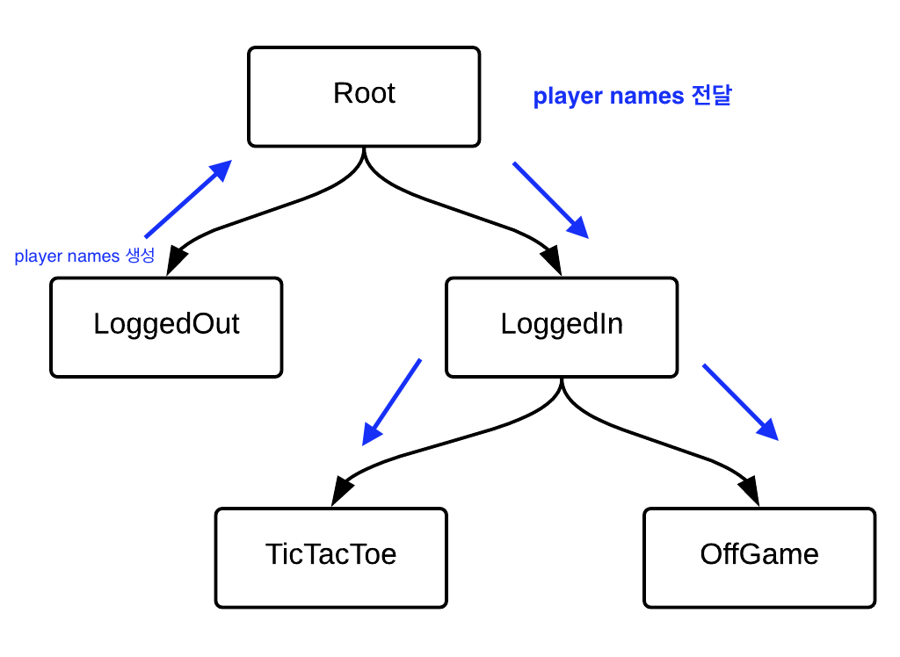

# RIBs Dependency Injection and Communication

RIBs github의 [튜토리얼](https://github.com/uber/RIBs/wiki/iOS-Tutorial-3)을 통해 RIBs에 대해 이해합니다.

## Goals

TicTacToe 게임의 시작 화면에 추가할 수 있는 몇 가지 사항이 있습니다. 우선, 게임에 참가하는 플레이어의 이름을 알고 싶으므로 해당 이름을 표시할 것입니다. 둘째로, 플레이어가 연속으로 여러 게임을 플레이하기로 결정한 경우 게임 점수를 추적하고 시작 화면에 표시할 것입니다.

이 튜토리얼의 주요 목표는 다음 개념을 설명하는 것입니다:

- builder의 build 메서드를 통해 동적 의존성을 자식 RIB에 전달하기. 
- 의존성 주입 트리(DI 트리)를 사용하여 정적 의존성 전달하기. 
	- Swift에서 extension을 기반으로 한 의존성 구성 준수. 
- RIB 라이프사이클을 사용하여 Rx 스트림 라이프사이클 관리하기.   

## Dynamic dependencies

튜토리얼 1에서는 게임을 위한 로그인 폼을 구축하고, LoggedOut RIB에서 플레이어 이름을 Root RIB까지 전달했습니다. 그러나 튜토리얼 2에서는 이러한 데이터를 새로 만든 화면에서 사용하지 않았고, 새로운 RIB에도 전달하지 않았습니다. 이번 튜토리얼에서는 플레이어 이름을 RIB 트리를 따라서 OffGame 및 TicTacToe RIB에 전달할 것입니다.

먼저, Root RIB에서 LoggedIn RIB로 플레이어 이름을 dynamic dependencies 로 전달하기 위해 LoggedInBuilder의 build 메서드를 업데이트합니다.

이를 위해, 기존의 listener 의존성에 추가로 두 개의 플레이어 이름을 LoggedInBuildable 프로토콜에 dynamic dependencies 로 포함시킬 것입니다:

```
protocol LoggedInBuildable: Buildable {
    func build(withListener listener: LoggedInListener, 
               player1Name: String, 
               player2Name: String) -> LoggedInRouting
}
```

그런 다음, LoggedInBuilder의 build 메서드 구현을 업데이트합니다:

```
func build(withListener listener: LoggedInListener, player1Name: String, player2Name: String) -> LoggedInRouting {
    let component = LoggedInComponent(dependency: dependency,
                                      player1Name: player1Name,
                                      player2Name: player2Name)
```

마지막으로, LoggedInComponent 이니셜라이저를 업데이트하여 플레이어 이름을 DI 트리에 저장합니다. LoggedInComponent 내에서 상수로 플레이어 이름을 저장할 것입니다:

```
let player1Name: String
let player2Name: String

init(dependency: LoggedInDependency, player1Name: String, player2Name: String) {
    self.player1Name = player1Name
    self.player2Name = player2Name
    super.init(dependency: dependency)
}
```

이로써 LoggedIn의 부모로부터 제공되는 dynamic dependencies 인 플레이어 이름이 LoggedIn의 자식들이 사용할 수 있는 static dependencies로 변환됩니다.

다음으로, RootRouter 클래스를 업데이트하여 LoggedInBuildable의 build 메서드에 플레이어 이름을 전달합니다:

```
func routeToLoggedIn(withPlayer1Name player1Name: String, player2Name: String) {
    // Detach logged out.
    if let loggedOut = self.loggedOut {
        detachChild(loggedOut)
        viewController.dismiss(viewController: loggedOut.viewControllable)
        self.loggedOut = nil
    }

    let loggedIn = loggedInBuilder.build(withListener: interactor, player1Name: player1Name, player2Name: player2Name)
    attachChild(loggedIn)
}
```

이 모든 변경 사항을 통해, 사용자가 입력하고 LoggedOut RIB에서 처리한 플레이어 이름이 LoggedIn RIB 및 해당 자식들에서 사용할 수 있게 됩니다.

### Dynamic dependencies vs static dependencies

보시다시피, RIB를 구축할 때 플레이어 이름을 동적으로 LoggedIn RIB에 주입하기로 결정했습니다. 대신, RIB 트리를 통해 이러한 의존성을 정적으로 해결할 수도 있었습니다. 그러나 이 경우 플레이어 이름은 Root RIB가 생성될 때 초기화할 수 없으므로, optional로 설정해야 했습니다 (이 연습에서는 기본값으로 초기화하는 것이 불가능한 경우로 가정합니다).

optional 값으로 처리하기로 결정했다면, RIB 코드에 추가적인 복잡성을 도입해야 했습니다. LoggedIn RIB과 그 자식들은 적절한 플레이어 이름 대신에 nil 값이 올 수 있는 경우를 처리해야 했으며, 이는 분명히 그들의 책임을 벗어나는 일이었습니다. 대신, 사용자가 이름을 입력한 후 가능한 빨리 플레이어 이름을 해결하고(nil 값 처리도 포함) 앱의 다른 부분에서 이 부담을 제거해야 합니다. 올바르게 scope를 지정한 의존성을 사용하면 무리한 또는 불안정한 코드를 제거하고 불변한 가정을 할 수 있습니다.

## RIBs Dependencies and Components

지금까지 RIBs 튜토리얼에서 의존성과 컴포넌트에 대해 논의하지 않았으므로, 계속 진행하기 전에 간단하게 어떤 것인지 설명하는 것이 타당합니다.

RIBs 용어에서 의존성은 RIB가 적절히 인스턴스화되기 위해 부모로부터 필요한 의존성들을 나열한 프로토콜입니다. 컴포넌트는 의존성 프로토콜의 구현체입니다. 컴포넌트는 RIB 구현체 및 해당 자식들에 대해 생성하는 의존성을 소유하는 것 뿐만 아니라, 부모 RIB에서 자식 RIB의 Builder로 자신의 의존성을 제공하는 역할도 담당합니다.

일반적으로 부모 RIB가 자식 RIB을 인스턴스화할 때, 부모의 컴포넌트를 자식의 Builder에 생성자 의존성으로 주입합니다. 주입된 각 컴포넌트는 자체적으로 어떤 의존성을 자식들에게 노출할지 결정합니다.

컴포넌트에 포함된 의존성은 일반적으로 DI 트리를 통해 전달되어야 하는 상태를 유지하거나, 성능상의 이유로 RIB들 간에 공유되는 생성이 비용이 큰 경우입니다.

## DI 트리를 사용하여 플레이어 이름을 OffGame 스코프로 전달하기

이제 플레이어 이름을 해결하고 LoggedIn RIB에 주입될 때 유효한 것으로 확인했으므로, DI 트리를 통해 안전하게 플레이어 이름을 OffGame RIB에 전달하여 "Start Game" 버튼과 함께 표시할 수 있습니다.

이를 위해 OffGameDependency 프로토콜에서 플레이어 이름을 의존성으로 선언합니다:

```
protocol OffGameDependency: Dependency {
    var player1Name: String { get }
    var player2Name: String { get }
}
```

이러한 정적 의존성은 부모 RIB에 의해 OffGame RIB의 초기화 중에 전달되어야 합니다.

다음으로, OffGameComponent에서 OffGame의 자체 범위에서 이러한 의존성을 사용할 수 있도록 만듭니다. 이는 OffGameComponent에서 정의된 클래스입니다.

```
final class OffGameComponent: Component<OffGameDependency> {
    fileprivate var player1Name: String {
        return dependency.player1Name
    }

    fileprivate var player2Name: String {
        return dependency.player2Name
    }
}
```

이 속성들은 fileprivate로 표시되어 있습니다. 이는 OffGameBuilder.swift 파일 내에서만 접근 가능하며, 따라서 자식 범위에 노출되지 않습니다. LoggedInComponent에서 fileprivate 액세스 제어를 사용하지 않은 이유는 이 값을 OffGame 자식 범위에 제공하기 위해서입니다.

이전 단계에서 이미 플레이어 이름을 LoggedInComponent에 추가했으므로, 방금 추가한 새로운 의존성을 충족시키기 위해 OffGame의 부모 범위인 LoggedIn 스코프를 수정할 필요는 없습니다.

다음으로, 생성자 주입을 통해 OffGameViewController에 이러한 의존성을 전달하여 플레이어 이름을 표시합니다. OffGameInteractor에 의존성을 먼저 전달하고, interactor가 자신의 OffGamePresentable의 메서드를 호출하여 이 정보를 표시할 수도 있지만, 플레이어 이름을 표시하는 데 추가 처리가 필요하지 않으므로, 바로 뷰 컨트롤러에 전달할 수 있습니다. OffGameViewController의 player1Name과 player2Name 상수를 사용하여 생성자를 통해 전달받은 값들을 저장할 것입니다.

OffGameBuilder를 업데이트하여 의존성을 뷰 컨트롤러에 주입합니다.

```
final class OffGameBuilder: Builder<OffGameDependency>, OffGameBuildable {
    override init(dependency: OffGameDependency) {
        super.init(dependency: dependency)
    }

    func build(withListener listener: OffGameListener) -> OffGameRouting {
        let component = OffGameComponent(dependency: dependency)
        let viewController = OffGameViewController(player1Name: component.player1Name,
                                                   player2Name: component.player2Name)
        let interactor = OffGameInteractor(presenter: viewController)
        interactor.listener = listener
        return OffGameRouter(interactor: interactor, viewController: viewController)
    }
}
```

OffGameViewController를 수정하여 초기화 중에 받은 플레이어 이름을 저장하도록 합니다.

```
...

private let player1Name: String
private let player2Name: String

init(player1Name: String, player2Name: String) {
    self.player1Name = player1Name
    self.player2Name = player2Name
    super.init(nibName: nil, bundle: nil)
}

...
```

이렇게 함으로써 OffGame RIB의 뷰 컨트롤러 UI를 업데이트하여 화면에 플레이어 이름을 표시할 수 있습니다. 시간을 절약하기 위해 제공된 코드를 사용할 수 있습니다.

이제 앱을 실행하여 로그인 후 시작 화면에서 플레이어 이름을 확인할 수 있어야 합니다.

## ReactiveX 스트림을 사용하여 점수를 추적

현재 애플리케이션은 게임 후에 점수를 추적하지 않습니다. 게임이 끝나면 사용자는 시작 화면으로 리디렉션됩니다. 우리는 애플리케이션을 개선하여 점수를 업데이트하고 시작 화면에 표시할 것입니다. 이를 위해 반응형 스트림을 생성하고 관찰할 것입니다.

반응형 프로그래밍 기술은 RIBs 아키텍처에서 널리 사용됩니다. 이들을 사용하는 가장 일반적인 용도 중 하나는 RIBs 간 통신을 용이하게 하는 것입니다. 자식 RIB가 부모로부터 동적 데이터를 받아야 할 때, 데이터를 옵저버블 스트림으로 래핑하고 이 스트림을 소비자 측에서 구독하는 것이 일반적인 방법입니다. 이 튜토리얼은 리액티브 프로그래밍과 옵저버블 스트림의 주요 개념에 대해 익숙한 독자를 가정합니다. 더 자세한 내용은 ReactiveX 문서를 참조하십시오.

우리의 경우, 현재 게임의 상태를 제어하는 TicTacToe RIB에서 게임 점수를 업데이트해야 합니다. 이 점수는 화면을 소유한 OffGame RIB에서 읽어야 합니다. TicTacToe와 OffGame은 서로를 알지 못하며 직접적으로 데이터를 교환할 수 없습니다. 그러나 두 RIB 모두 동일한 부모인 LoggedIn RIB를 가지고 있습니다. 이제 이 RIB에서 점수 스트림을 구현하여 두 자식에게 스트림에 대한 액세스를 제공해야 합니다.

LoggedIn 그룹에 ScoreStream이라는 새로운 Swift 파일을 생성하고 TicTacToe 타겟에 추가합니다. 시간을 절약하기 위해 제공된 스트림 구현을 사용하십시오. 

ScoreStream 프로토콜의 읽기 전용 버전인 ScoreStream과 가변 버전인 MutableScoreStream 두 가지 버전의 점수 스트림 프로토콜을 선언했음에 유의하세요. 아래에서 두 버전 간의 차이점을 설명하겠습니다.

LoggedInComponent에서 공유된 ScoreStream 인스턴스를 생성합니다.

```
var mutableScoreStream: MutableScoreStream {
    return shared { ScoreStreamImpl() }
}
```

shared 인스턴스는 주어진 스코프에 대해 생성된 싱글톤을 의미합니다 (우리의 경우에는 LoggedIn RIB와 해당 모든 하위 RIB가 범위에 포함됩니다). 대부분의 상태를 가지는 객체와 마찬가지로, 이러한 스트림은 일반적으로 스코프 별 싱글톤입니다. 그러나 다른 대부분의 의존성은 상태를 가지지 않으므로 공유되지 않아야 합니다.

mutableScoreStream 속성이 fileprivate가 아닌 (암시적) internal 접근 제어자로 생성된 것에 유의하십시오. 이 속성을 파일 외부로 노출해야 합니다. 왜냐하면 LoggedIn의 하위 RIB에서 접근할 수 있어야 하기 때문입니다. 이 요구사항이 해당되지 않을 때는 선언 파일 내에서 스트림을 캡슐화하는 것이 좋습니다.

또한, 컴포넌트의 기본 구현에는 직접적으로 사용되는 종속성만을 배치해야 하며, 플레이어 이름과 같은 동적 종속성으로부터 주입된 저장 속성은 예외입니다. 이 경우 LoggedIn RIB는 LoggedInInteractor 클래스에서 mutableScoreStream을 직접 사용할 것이므로, 스트림을 기본 구현에 배치하는 것이 적절합니다. 그렇지 않으면 의존성을 확장(extension)인 LoggedInComponent+OffGame에 배치했을 것입니다.

이제 mutableScoreStream을 LoggedInInteractor로 전달하여 나중에 점수를 업데이트할 수 있도록 하겠습니다. 또한 프로젝트를 컴파일할 수 있도록 LoggedInBuilder를 업데이트해야 합니다.

```
...

private let mutableScoreStream: MutableScoreStream

init(mutableScoreStream: MutableScoreStream) {
    self.mutableScoreStream = mutableScoreStream
}

...
```

```
func build(withListener listener: LoggedInListener, player1Name: String, player2Name: String) -> LoggedInRouting {
    let component = LoggedInComponent(dependency: dependency,
                                      player1Name: player1Name,
                                      player2Name: player2Name)
    let interactor = LoggedInInteractor(mutableScoreStream: component.mutableScoreStream)

...
```

## 게임 종료 후 플레이어 점수를 표시하기 위해 읽기 전용 ScoreStream을 OffGame RIB로 전달

OffGameDependency 프로토콜에서 OffGame RIB의 스코프에 읽기 전용 ScoreStream을 Dependency로 선언합니다.

```
protocol OffGameDependency: Dependency {
    var player1Name: String { get }
    var player2Name: String { get }
    var scoreStream: ScoreStream { get }
}
```

그런 다음 OffGameComponent에서 현재 범위에 종속성을 제공합니다.

```
fileprivate var scoreStream: ScoreStream {
    return dependency.scoreStream
}
```

OffGame의 빌더는 나중에 OffGameInteractor에서 스트림을 사용할 수 있도록 스트림을 주입하도록 수정해야 합니다.

```
func build(withListener listener: OffGameListener) -> OffGameRouting {
    let component = OffGameComponent(dependency: dependency)
    let viewController = OffGameViewController(player1Name: component.player1Name,
                                               player2Name: component.player2Name)
    let interactor = OffGameInteractor(presenter: viewController,
                                       scoreStream: component.scoreStream)
```

마지막으로 OffGameInteractor의 생성자를 업데이트하여 점수 스트림을 받아와서 비공개 상수에 저장해야 합니다.

```
...

private let scoreStream: ScoreStream

init(presenter: OffGamePresentable,
     scoreStream: ScoreStream) {
    self.scoreStream = scoreStream
    super.init(presenter: presenter)
    presenter.listener = self
}

...
```

OffGame의 컴포넌트에서 점수 스트림 변수를 정의할 때, 접근 제어자로 fileprivate를 사용하고 LoggedIn RIB의 정의와 대조적으로 사용합니다. 현재 OffGame의 하위 RIB에 이 종속성을 노출할 계획이 없으므로 이렇게 처리합니다.

읽기 전용 점수 스트림은 OffGame 스코프에서만 필요하며 LoggedIn RIB에서 사용되지 않으므로 이 종속성을 LoggedInComponent+OffGame 확장에 배치할 것입니다. 이 파일의 stub 구현이 이미 제공되어 있습니다.

제공된 확장 stub을 사용하거나 파일을 삭제하고 컴포넌트 확장 Xcode 템플릿을 사용하여 다시 생성할 수 있습니다. 컴포넌트 확장과 작업하는 방법에 대한 자세한 내용은 파일의 TODO 주석을 참조하십시오.

컴포넌트 확장에 점수 스트림을 Dependency에 추가하세요.

```
extension LoggedInComponent: OffGameDependency {
    var scoreStream: ScoreStream {
        return mutableScoreStream
    }
}
```

MutableScoreStream 프로토콜이 읽기 전용 버전을 확장하므로, 읽기 전용 스트림 구현을 예상하는 하위 RIB에 노출시킬 수 있습니다.

## 점수를 스트림에 구독하여 점수를 표시

이제 OffGame RIB은 scoreStream을 구독해야 합니다. 스트림에서 새로운 Score 값을 받은 후에 OffGamePresentable은 이 값을 뷰 컨트롤러로 전달하여 화면에 표시합니다. 반응형 구독을 사용하면 저장된 상태를 제거하고 데이터 변경에 따라 UI를 자동으로 업데이트할 수 있습니다.

먼저 OffGamePresentable 프로토콜을 업데이트하여 점수 값을 설정할 수 있도록 합시다. 기억하세요. 이 프로토콜은 인터랙터에서 뷰로 통신하는데 사용됩니다.

```
protocol OffGamePresentable: Presentable {
    weak var listener: OffGamePresentableListener? { get set }
    func set(score: Score)
}
```

OffGameInteractor 클래스에서 구독을 생성하고, 스트림이 값을 발생할 때 OffGamePresentable을 호출하여 새로운 점수를 설정합니다.

```
private func updateScore() {
    scoreStream.score
        .subscribe(
            onNext: { (score: Score) in
                self.presenter.set(score: score)
            }
        )
        .disposeOnDeactivate(interactor: self)
}
```

여기서는 disposeOnDeactivate 확장을 사용하여 Rx 구독의 lifecycle를 처리합니다. 이름에서 알 수 있듯이, 구독은 주어진 인터랙터인 OffGameInteractor가 비활성화될 때 자동으로 dispose 됩니다. Rx lifecycle 관리 유틸리티를 활용하기 위해 거의 항상 인터랙터나 worker 클래스에서 Rx 구독을 생성해야 합니다.

그리고 OffGameInteractor의 didBecomeActive 라이프사이클 메서드에서 updateScore 메서드를 호출합니다. 이렇게 하면 OffGameInteractor가 활성화될 때마다 새로운 구독을 생성할 수 있으며, disposeOnDeactivate의 사용과 잘 어울립니다.

```
override func didBecomeActive() {
    super.didBecomeActive()

    updateScore()
}
```

마지막으로, 점수를 표시하기 위해 UI를 구현해야 합니다. 시간을 절약하기 위해 여기에서 제공되는 OffGameViewController 구현을 사용할 수 있습니다.

지금 앱을 빌드하고 시작하면 시작 화면에 점수가 표시됩니다. 점수가 변경될 때마다 OffGame RIB에 알림을 보내는 반응형 구독을 추가하고, 이에 대응하여 뷰 컨트롤러를 업데이트했습니다. 하지만 아직 게임이 종료된 후에 실제로 점수를 업데이트하는 코드가 없습니다. 이를 구현해 봅시다.

## 게임 종료 시 score stream 업데이트

게임이 종료된 후, TicTacToe RIB은 리스너를 호출하여 LoggedInInteractor로 전달해야 합니다. 이곳에서 점수 스트림을 업데이트해야 합니다.

TicTacToe의 리스너를 업데이트하여 게임의 승자 정보를 공유하도록 합시다.

```
protocol TicTacToeListener: class {
    func gameDidEnd(withWinner winner: PlayerType?)
}
```

이제 TicTacToeInteractor의 구현을 업데이트하여 방금 업데이트한 리스너에 승자를 전달하도록 할 것입니다.

이를 위한 다양한 방법이 있습니다. TicTacToeInteractor에서 승자를 지역 변수에 저장할 수도 있고, TicTacToeViewController에서 사용자가 경고를 닫은 후 closeGame 메서드를 통해 승자를 다시 인터랙터로 전달할 수도 있습니다. 기술적으로 두 가지 방법 모두 옳고 적절합니다. 각 솔루션의 장단점을 알아봅시다.

TicTacToeInteractor에 저장된 로컬 변수를 사용하면 인터랙터 내에서 필요한 모든 데이터를 캡슐화한다는 이점이 있습니다. 하지만 mutable 상태를 유지해야 한다는 단점이 있습니다. 우리의 RIB는 스코프가 잘 정의되어 있기 때문에 이는 어느 정도 괜찮다고 볼 수 있습니다. 각 RIB의 지역 상태는 잘 캡슐화되고 제한됩니다. 새로운 게임을 시작한 후 새로운 TicTacToe RIB를 생성하면 이전 RIB는 이전의 지역 변수와 함께 해제됩니다.

뷰 컨트롤러에서 데이터를 다시 전달하는 방식을 선택하면 인터랙터에 local mutable 상태를 저장하지 않을 수 있지만, 비즈니스 로직 처리에 뷰 컨트롤러에 의존해야 합니다.

두 가지 방법의 장점을 모두 활용하기 위해 Swift 클로저를 사용할 수 있습니다. 인터랙터가 게임이 종료되었음을 뷰 컨트롤러에 알릴 때, 뷰 컨트롤러가 상태를 업데이트한 후에 호출될 완료 핸들러를 제공할 수 있습니다. 이렇게 하면 승자를 TicTacToeInteractor 내에 캡슐화하고 추가 상태를 저장하지 않을 수 있습니다. 또한, 뷰 컨트롤러의 리스너에 있는 closeGame 메서드는 불필요합니다.

완료 핸들러를 사용하여 점수를 업데이트하는 방법은 다음과 같습니다.

TicTacToePresentableListener에서 closeGame 메서드의 선언을 제거하세요.

```
protocol TicTacToePresentableListener: class {
    func placeCurrentPlayerMark(atRow row: Int, col: Int)
}
```

TicTacToeViewController에서 announce 메서드를 수정하여 완료 핸들러를 인자로 받고, 사용자가 경고를 닫은 후에 호출되도록 합니다. announce 메서드는 인터랙터가 플레이어 중 한 명이 게임에서 이겼다고 판단한 후에 호출됩니다.

```
func announce(winner: PlayerType?, withCompletionHandler handler: @escaping () -> ()) {
    let winnerString: String = {
        if let winner = winner {
            switch winner {
            case .player1:
                return "Red won!"
            case .player2:
                return "Blue won!"
            }
        } else {
            return "It's a draw!"
        }
    }()
    let alert = UIAlertController(title: winnerString, message: nil, preferredStyle: .alert)
    let closeAction = UIAlertAction(title: "Close Game", style: UIAlertActionStyle.default) { _ in
        handler()
    }
    alert.addAction(closeAction)
    present(alert, animated: true, completion: nil)
}
```

TicTacToePresentable 프로토콜에서 announce 메서드의 선언을 업데이트하여 완료 핸들러 인자를 포함하도록 합니다.

```
protocol TicTacToePresentable: Presentable {
    ...

    func announce(winner: PlayerType?, withCompletionHandler handler: @escaping () -> ())
}
```

TicTacToeInteractor에서 presenter의 announce 메서드 호출을 완료 핸들러와 함께 업데이트합니다.

```
func placeCurrentPlayerMark(atRow row: Int, col: Int) {
    guard board[row][col] == nil else {
        return
    }

    let currentPlayer = getAndFlipCurrentPlayer()
    board[row][col] = currentPlayer
    presenter.setCell(atRow: row, col: col, withPlayerType: currentPlayer)

    if let winner = checkWinner() {
        presenter.announce(winner: winner) {
            self.listener?.gameDidEnd(withWinner: winner)
        }
    }
}
```

마지막으로, LoggedInInteractor에서 gameDidEnd 메서드의 구현을 업데이트하여 새로운 승자가 있을 때 점수 스트림을 업데이트합니다.

```
func gameDidEnd(withWinner winner: PlayerType?) {
    if let winner = winner {
        mutableScoreStream.updateScore(withWinner: winner)
    }
    router?.routeToOffGame()
}
```

이제 점수 스트림이 완전히 작동합니다. 앱을 빌드하고 실행하면, 플레이어가 게임에서 이길 때마다 시작 화면의 점수가 올바르게 업데이트되는 것을 볼 수 있습니다.

## 요약

- dynamic dependency: build 시 dependency를 주입해준다.
- static dependency: 자식 dependency 프로토콜에 값을 작성하고 부모 컴포넌트에 값을 생성하여 사용한다.
- 부모 -> 자식 RIB 간 통신이 필요할 때 rx를 사용할 수 있다.
- intractor의 disposeOnDeactivate extension 함수를 사용하면 intractor가 deactivate 될 때 rx 구독을 dispose 할 수 있다.

## RIB 간 데이터 전달 흐름


1. 플레이어 이름은 LoggedOut RIB의 View에서 유저에게 처음 입력을 받는다. 
2. 입력 후 로그인 버튼을 누르면 LoggedOutInteractor의 login 함수가 호출된다. 
   - `func login(withPlayer1Name player1Name: String?, player2Name: String?)`
3. login 함수 파라미터로 전달된 플레이어 이름들을 listener?.didLogin 함수에 파라미터로 전달하여 호출한다. 
   - listener를 통해 상위 RIB 기능 실행
   -  `listener?.didLogin(withPlayer1Name: player1NameWithDefault, player2Name: player2NameWithDefault)`
4. LoggedOut RIB의 상위 RIB인 RootRIB의 interactor에서 didLogin 호출로 rootRouter의 routeToLoggedIn 함수가 호출된다. 
    - `router?.routeToLoggedIn(withPlayer1Name: player1Name, player2Name: player2Name)`
5. routeToLoggedIn 함수에서 LoggedOut RIB을 detach하고 loggedInBuilder를 통해 build 함수를 호출할 때 플레이어 이름을 파라미터로 전달한다. 그리고 빌드된 LoggedIn RIB을 attach한다.
6. LoggedIn의 build 함수에서 플레이어 이름을 component에 담아 OffGameBuilder와 TicTacToeBuilder의 dependency로 전달한다.
7. OffGameBuilder 빌드 함수에서 component로 전달 받은 플레이어 이름을 View에 전달하여 UI에 표시한다.
