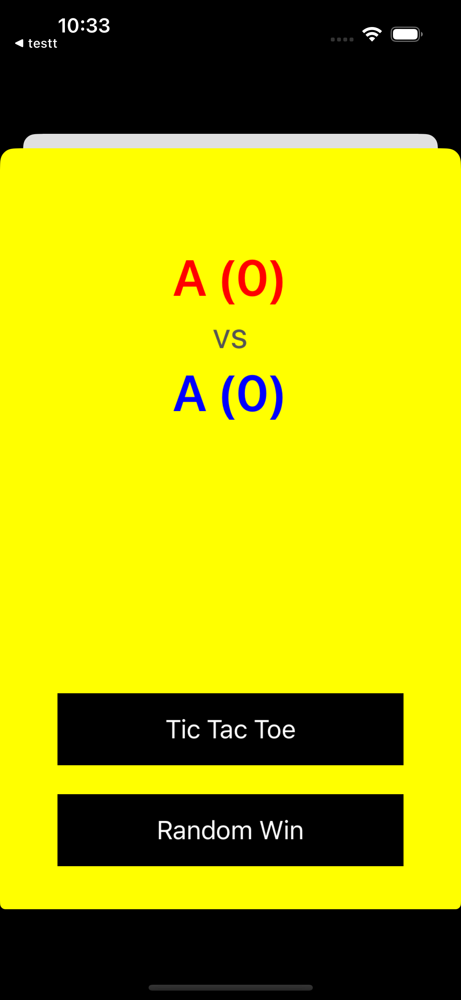

## RIB

- RIBs에서 하나의 모듈을 RIB이라고 한다. RIB에는 Router, Interactor, Builder, View(ViewController optional), Presenter(optional)
- Router는 화면 전환을 담당한다.
- Interactor는 api를 호출하여 응답 받은 데이터를 가공하는 비즈니스 로직을 담당한다. router의 화면 전환 함수를 호출하기도 한다. 또, 상위 RIB과의 소통도 interactor가 담당한다.
- Builder는 RIB의 생성을 담당한다. build에서 RIB에 대한 모든 초기화가 이루어진다. 그리고 builder는 상위 RIB의 component를 init(dependency:)로 받아 저장해둔다.
- View(optional): ViewController
- Presenter(optional): view에 전달할 값을 가공

## RIB tree

- RIBs는 부모 RIB과 자식 RIB이 tree 구조를 이룬다.
- tree의 복잡성을 낮추기 위해 depth가 깊어지지 않도록 설계하는 것이 좋다.

## view less, viewfull

- viewless RIB
	- view가 없는 RIB
	- 상위 rib의 view를 갖는다. dependency를 통해 상위 view를 전달 받는다.
	- willResignActive의 router?.cleanupViews()으로 present 또는 push 된 하위 rib의 view들을 정리해줘야한다.
- viewful RIB
	- view가 없는 RIB

## dependency

- builder init 시에 상위 RIB의 component를 dependency 파라미터로 주입 받는다. 그리고 build 시에 주입 받은 dependency를 자신의 component에 담아 view, interactor, router등 자신의 rib 요소에 필요한 값을 전달해준다.
- RIB 라우팅 시 계속해서 부모 RIB의 component를 dependency로 주입 받아 자신의 component에 담는다.
- static dependencies
	- 상위 RIB의 component를 dependency 파라미터로 전달
- dynamic dependencies
	- builder의 build 파라미터로 전달

RIBs 튜토리얼에서 player1Name, player2Name을 loggedRIB 빌드시에는 dynamic 디펜던시로 전달하였고 OffGame, RandomWin RIB들에는 static dependency로 전달하였다.
![[RIBs_dependency.png]]

## Deeplinking

### Workflow

특정 작업을 구성하는 일련의 step들이다. 이 작업들이 RIB 트리에서 진행됨에 따라 tree를 올리거나 내릴 수 있다 보통은 root에서 부터 아래로 내려가며 원하는 RIB으로 이동할 수 있다. workflow가 시작되면 모든 step을 실행한다. onStep안의 로직이 비동기적으로 실행되도 앞 step이 완료되어야 다음 step으로 넘어간다.

### ActionableItem

step에서 실행되어야 할 로직을 포함한다.

## Scope

하나의 연결된 RIB tree를 Scope라고 볼 수 있다. 예를 들어 LoggedOutRIB의 하위 RIB과 LoggedInRIB의 하위 RIB은 다른 scope에 있다고 볼 수 있다. 그리고 LoggedInRIB, LoggedOutRIB 은 RootRIB scope에 있다고 볼 수 있다.

## Shared

특정 scope 내에서 값을 공유할 수 있다.

## attachChild

 1. 이미 attach된 childRIB을 또 attach하려고 하면 assert 처리로 에러를 발생시킨다.
 2. children에 child를 append한다.
 3. interactor의 active 함수를 호출한다. active함수는 disposable을 초기화하고 isActiveSubject에 true로 바꾼 후 didBecomeActive 함수를 호출한다. 
 4. router의 load 함수 호출한다. load 함수는 internalDidLoad 함수를 호출하고 didLoad 함수를 호출한다.
 
## detachChild
 
 1. interactor의 deactivate 함수를 호출한다. deactivate 함수는 willResignActive 함수를 호출하고 activenessDisposable을 dispose한 후 isActiveSubject를 false로 변경한다.
 2. children에서 해당 child를 제거한다.

## 기타

LoggedInRIB은 TicTacToe, RandomWin, OffGame RIB들의 화면 전환과 주입할 데이터를 모두 관리한다.

OffGameRIB 하위에는 BasicScoreBoardRIB이 있고 BasicScoreBoardView는 OffGameViewController의 childView가 된다. 그리고 scoreBoard의 스코어는 LoggInRIB에게 static dendency로 주입 받는다. 
스코어는 각 게임에게 rx stream으로 전달된다. (특정 childRIB에서 parentRIB에게 값을 전달하고 shared rx stream을 통해 다른 childRIB에게 값을 전달할 수 있다.)

RIBs 튜토리얼에서 OffGame 화면은 아래 화면이다. 아래 화면에서 게임 진행 버튼을 누르면 아래와 같이 동작한다.
1. game 버튼을 누르면 OffGameInteractor에서 listener를 통해 loggedInIntractor(상위)의 startGame 함수에 버튼에 해당하는 게임 builder를 담아 전달한다. (`listener?.startGame(with: game.builder)`) 
2. startGame 호출 시 LoggedInRouter의 routeToGame 함수를 호출한다. (`router?.routeToGame(with: gameBuilder)`)
3. (TicTacToe or RandomWin)Builder를 build하고, OffGame화면을 dismiss 한 뒤에 게임 화면을 present한다.

