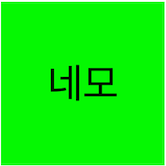
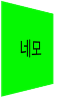
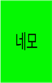

# iOS 3D Effect

뷰의 회전, 이동, 크기, 입체 효과 등을 적용하는 방법에 대해 학습합니다.

CoreAnimation > CALayer > CATransform3D

## Core Animation이란?
- CPU 및 앱 성능을 저하시키지 않으면서 높은 프레임 속도와 부드러운 애니메이션을 제공합니다. 
 - CoreAnimation은 실제 드로잉 작업을 온보드 그래픽 하드웨어에 전달하여 렌더링 속도를 높입니다. 이 자동 그래픽 가속은 CPU에 부담을 주지 않고 앱 속도를 저하시키지 않으면서 프레임을 생성하여 부드러운 애니메이션을 제공합니다. 
- 시작 및 끝 지점과 같은 몇 가지 애니메이션 매개 변수를 구성하고 Core Animation에 시작하도록 지시하면 애니메이션의 각 프레임을 그려 작업을 수행합니다.
- Core Animation은 드로잉 시스템 자체가 아닙니다. 하드웨어에서 앱 콘텐츠를 합성하고 조작하기 위한 인프라입니다. 이 인프라의 핵심 컨텐츠를 관리하고 조작하는 데 사용하는 것은 Layer객체입니다. Layer는 컨텐츠를 그래픽 하드웨어에서 쉽게 조작할 수 있는 비트 맵으로 캡쳐합니다. 대부분의 앱에서 레이어는 뷰의 컨텐츠를 관리하는 방법으로 사용되지만 필요에 따라 독립형 레이어를 만들 수도 있습니다.
- Layer에 계층 관계를 구성할 수 있습니다. 레이어 배열은 뷰와 유사한 방식으로 관리하는 시각적 컨텐츠에 영향을 줍니다. 뷰에 연결된 레이어 세트의 계층 구조는 해당 뷰 계층 구조를 미러링 합니다. 또한 독립형 레이어를 레이어 계층 구조에 추가하여보기 이상의 응용 프로그램 시각적 콘텐츠를 확장 할 수 있습니다.

## CALayer
이미지 기반 컨텐츠를 관리하고 해당 컨텐츠에서 애니메이션을 수행할 수 있는 객체입니다.

## Transforms
Core animation의 레이어에 affine transformation을 적용할 변환 행렬을 정의합니다.

*affine transformation: 공선점을 공선점으로 보내는 두 affine space 사이의 함수이다. [by. 위키백과](https://ko.wikipedia.org/wiki/%EC%95%84%ED%95%80_%EB%B3%80%ED%99%98)
  affine space 는 크기, 방향, 위치를 표현할 수 있는 기하학 공간이라고 한다.

*행렬: 수학에서, 행렬(行列, 영어: matrix)은 수나 수를 나타내는 문자를 괄호 안에 직사각형 꼴로 배열한 것이다. 다음은 여섯 개의 원소를 가진 2 × 3 행렬의 예이다. 컴퓨터 그래픽스에서는 3차원 이미지를 2차원 평면에 투영하거나 사실적인 움직임을 그려내기 위해서 사용한다. [by. 위키백과](https://ko.wikipedia.org/wiki/%ED%96%89%EB%A0%AC)

간단히 다양한 차원으로 layer를 그리기 위한 행렬(점의 좌표 열)을 정리한다고 이해하면 될 거 같습니다.

## CATransform3D

코어 애니메이션에서 사용되는 standard transform matrix입니다.
transform matrix는 레이어 내용을 회전, 크기 조절, 변환, 기울이기 및 투영하는 데 사용됩니다. CATransform3D 데이터를 생성, 연결 및 수정하기 위한 기능이 제공됩니다.

## CATransform3D Methods

### 1. CATransformMake3DTranslate
위치를 조정(tx, ty, tz)하고 Transform(변환 행렬)을 리턴합니다.
tx의 t는 Translate입니다.

### 2. CATransformMake3DScale
크기를 조정(sx, sy, sz)하고 Transform(변환 행렬)을 리턴합니다.
sx의 s는 Scale입니다.

### 3. CATransformMake3DRotate
회전 (angle, x,  y, z)을 조정하고 Transform(변환 행렬)을 리턴합니다.
벡터를 기준으로 회전합니다. 벡터의 길이가 0 이면 동작은 정의되지 않습니다.

위의 함수 외에도 여러 메서드가 있지만 기본적인 Transform 생성에 대해 정리하였습니다.
Transform 들은 ChainingTransforms 메서드들을 통해 중첩이 가능합니다.

또 Transform에는 3D 모델을 구현하는 데 있어 중요한 원근감(perspective)을 설정 하는 기능도 있습니다.

```
var transform = CATransform3DIdentity
transform.m34 = -1.0 / 300.0
```
이렇게 어떤 transform 의 m34 변수에 값을 입력해 주면 됩니다. 이 m34가 뜻하는 의미는 행렬의 3, 4 위치에 있는 항목이라고 합니다. 그리고 m34에 들어가는 값은 거리감의 정도라고 보시면 되겠습니다.
300.0 이 값이 낮아질수록 입체감이 강해지게 됩니다.

 

전에 이런 label을 

 

이렇게 비스듬히 보이는 label로 애니메이팅 할 일이 있었는데 CATransformMake3DRotate 메서드를 이용해 y축을 바꾸면 비스듬히 보일 거라고 생각을 했었습니다.
그런데 아래 이미지와 같이 가로 크기만 작아지는 현상을 보고 당황 했었습니다.



저렇게 비스듬히 보이는 label을 만드려면
m34에 값을 입력하면 됩니다.

[예제 프로젝트](https://github.com/pcugogo/study/tree/master/CATransform3D/CATransform3DExample)

[학습 자료: 애플 공식 문서](https://developer.apple.com/library/archive/documentation/Cocoa/Conceptual/CoreAnimation_guide/CoreAnimationBasics/CoreAnimationBasics.html#//apple_ref/doc/uid/TP40004514-CH2-SW3)
