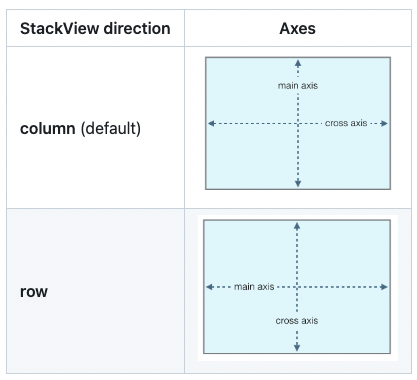

## direction

- stackView의 axis처럼 정렬 방향 설정 가능 (행렬)
- `column`/ `columnReverse`/ `row`/`rowReverse`



## [justifyContent](https://github.com/layoutBox/FlexLayout#flexlayout--pinlayout:~:text=(10)%0A%20%20%20%20%7D-,justifyContent,-())

- main axis의 정렬
- [start(default)](https://github.com/layoutBox/FlexLayout#flexlayout--pinlayout:~:text=direction(.row)-,start%20(default),-Items%20are%20packed)/ [end](https://github.com/layoutBox/FlexLayout#flexlayout--pinlayout:~:text=the%20main%2Daxis.-,end,-Items%20are%20packed)/ [center](https://github.com/layoutBox/FlexLayout#flexlayout--pinlayout:~:text=the%20main%2Daxis.-,center,-items%20are%20centered)/ [spaceBetween](https://github.com/layoutBox/FlexLayout#flexlayout--pinlayout:~:text=the%20main%2Daxis.-,spaceBetween,-Items%20are%20evenly)/ [spaceAround](https://github.com/layoutBox/FlexLayout#flexlayout--pinlayout:~:text=at%20the%20end.-,spaceAround,-Items%20are%20evenly)/[spaceEvenly](https://github.com/layoutBox/FlexLayout#flexlayout--pinlayout:~:text=space%20around%20them.-,spaceEvenly,-Items%20are%20evenly)

## [alignItems](https://github.com/layoutBox/FlexLayout#flexlayout--pinlayout:~:text=(.center)-,alignItems,-())

- cross axis의 정렬
- [stretch(default)](https://github.com/layoutBox/FlexLayout#flexlayout--pinlayout:~:text=direction(.row)-,stretch%20(default),-start) / [start](https://github.com/layoutBox/FlexLayout#flexlayout--pinlayout:~:text=stretch%20(default)-,start,-end) / [end](https://github.com/layoutBox/FlexLayout#flexlayout--pinlayout:~:text=start-,end,-center) / [center](https://github.com/layoutBox/FlexLayout#flexlayout--pinlayout:~:text=start-,end,-center) / [baseline](https://github.com/layoutBox/FlexLayout#flexlayout--pinlayout:~:text=end-,center,-alignSelf())

## [wrap](https://github.com/layoutBox/FlexLayout#flexlayout--pinlayout:~:text=the%20other%20values.-,wrap,-())

- 뷰를 여러 줄로 줄바꿈 가능 
- [noWrap(default)](https://github.com/layoutBox/FlexLayout#flexlayout--pinlayout:~:text=Description-,noWrap,-(default)): 디폴트는 noWrap으로 flex item들이 한 줄로 표시 됨
- [wrap](https://github.com/layoutBox/FlexLayout#flexlayout--pinlayout:~:text=flex%20container%E2%80%99s%20width-,wrap,-Multi%2Dlines%2C%20direction): cross axis 축의 `순방향`으로 줄바꿈하면서 item들이 나열
- [wrapReverse](https://github.com/layoutBox/FlexLayout#flexlayout--pinlayout:~:text=top%2Dto%2Dbottom-,wrapReverse,-Multi%2Dlines%2C%20opposite): cross axis 축의 `역방향`으로 줄바꿈하면서 item들이 나열

## markDirty

- 기존 레이아웃을 invalidate 한다.
- 예를 들어, 뷰의 intrinsicContentSize에 맞춰 뷰 사이즈를 핏하게 맞춰주고 싶을 때 markDirty를 사용하여 레이아웃을 무효화하고 다시 `container.flex.layout()`을 호출하고 `view.setNeedsLayout()` 을 호출하면 된다.
- Dirty 플래그는 flexbox tree의 root로 전파되어, 어떤 item이 invalidate되면 해당 subtree 전체가 다시 계산되도록 보장된다고 한다.

## sizeThatFits

- 아래와 같이 피팅 사이즈를 구할 수 있다.
```
let layoutSize = viewA.flex.sizeThatFits(size: CGSize(width: 200, height: CGFloat.greatestFiniteMagnitude))
```

## intrinsicSize
- 뷰의 intrinsicContentSize와는 다른 값이고 언제 사용하는 값인지 모르겠다..

## 기타

define에서 addItem을 할 때 cornerRadius와 border를 설정할 수 있다.

## 출처
- https://github.com/layoutBox/FlexLayout#flexlayout--pinlayout
