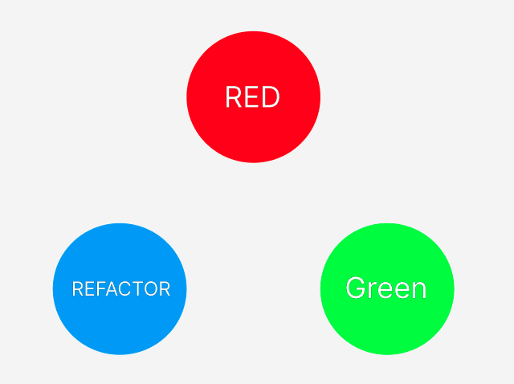

## TDD란?
이름과 같이 테스트 주도하에 개발을 하는 방식이다.

테스트 코드를 짜다보면 의존성 주입이 어렵거나 또 다른 이유로 테스트를 하기 어려울 수 있다.
그런데 테스트 코드를 먼저 짜고 기능이나 화면을 추가하게 되면 테스트를 위한 코드를 짜게 되면서 자연스럽게 결합도 낮은 코드를 작성할 수 있다.

## TDD cycle

1. 테스트 코드 작성 -> 어떤 기능을 구현할지 구체화
2. 테스트 실패 확인 -> 테스트 코드가 잘 실패하는지 검증
3. 테스트를 통과하는 최소한의 코드 추가 & 테스트 성공하는지 확인 -> 돌아가는 코드 확보
4. 코드 리팩터링 -> 돌아가는 코드와 테스트 코드가 있기때문에 좋은 설계와 코드에만 집중

## TDD 왜 해야할까?
TDD가 익숙해져 위 싸이클을 빠르게 진행할 수 있다면 보다 완결성이 높고 좋은 코드를 좀 더 빠르게 작성할 수 있을 것이라는 예상이 된다. 그리고 설계 -> 코딩 -> 검증 -> 리팩토링의 과정들은 개발을 하면서 항상 하게되는 일이다. 그렇지만 검증 -> 리팩토링 단계는 두려운 단계다. 기존에 잘 돌아가던 동작이 제대로 동작하지 않을 수 있기때문이다. 리팩토링을 한 후에는 항상 동작을 다시 테스트해 본다. 이 때 해당 동작에 대한 테스트 코드가 있으면 두려워할 필요가 없기때문에 굉장히 도움이 될 것 같다.

## 우려되는 점
필요성은 정말 느끼지만 아직 실제 프로젝트에서 시도해 본적이 없다. 기존 방식이 익숙하기 때문인 것 같다. 기존 방식으로 코딩을 하다가 TDD를 사용하는 것은 마치 가수가 창법을 바꾸는 것이나 야구에서 타자가 그동안 익숙했던 방망이 휘두르는 방식을 바꾸는 것과 같지 않을까? 토이프로젝트라도 개발하면서 TDD를 연습해 봐야겠다.
