1. 코드 완성 기능 향상
- 파일을 생성하고 struct나 class 등의 이름을 작성하려고 할 때, 파일 이름을 추천

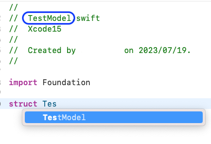
- SwiftUI의 View를 만들 때, View를 작성하는 도중 자동 완성

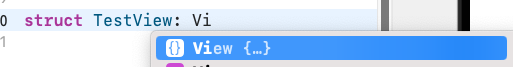

이 때 엔터를 치면 body를 자동으로 작성 ⬇️

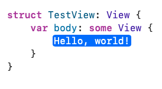

- 사용할 함수의 파라미터 목록을 전부 보고 싶을 때
  - 1. 자동 완성(기존과 동일)
       
  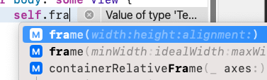
  
  - 2. 키보드에서 오른쪽 방향키 버튼 누르면 frame 파라미터 목록 모두 다나옴
    
  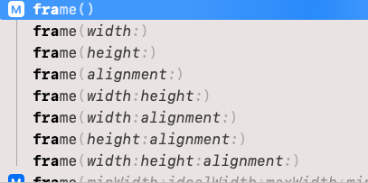
  
  - 옵션키 누르면 파라미터들 색상이 진해지고 엔터를 누르면 파라미터가 생략되지 않은 채로 코드 자동완성
  
  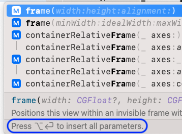


## Asset 
- 에셋에 추가한 이미지가 자동 완성된다.

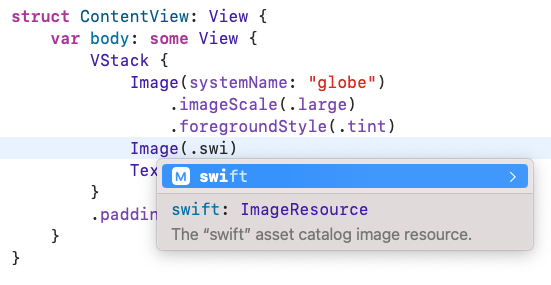
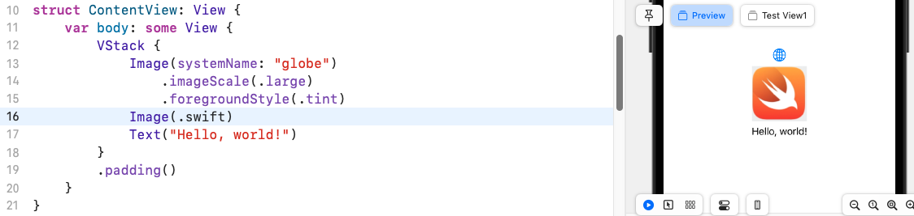

- 에셋에 추가한 이미지 이름과 다른 이름을 설정하면 error가 발생한다.
  
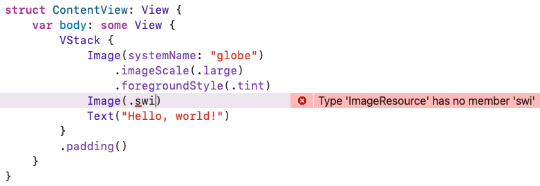

## Previews
- Preview를 훨씬 간편하게 사용할 수 있게 되었다.
- `#Preview`는 macro로 구현 됨

```
#Preview {
    ContentView()
}

#Preview("Test View") {
    ContentView()
}
```
![[./img/Preview_1.png]]

- UIKit도 똑같이 지원
  
![[./img/Preview_2_UIKit.png]]

## Bookmark
- Xcode에서 코드를 북마크할 수 있는 기능이 생겼다. 북마크한 곳에 메모도 남길 수 있어 매우 편리하게 사용될 것 같다.
- 검색 결과에 나온 코드도 바로 북마크할 수 있다.
  
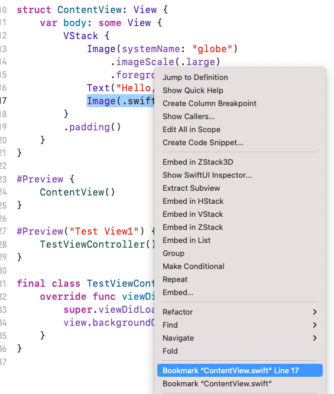

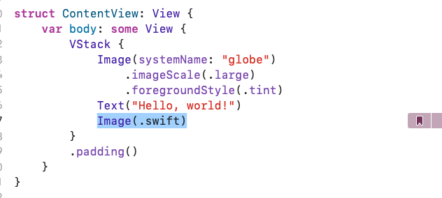

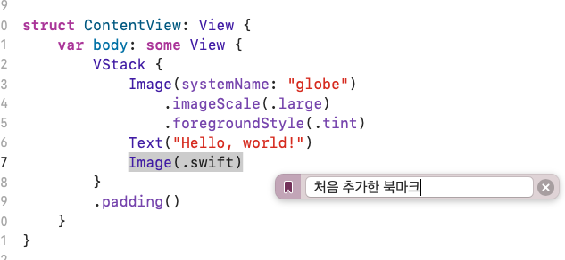

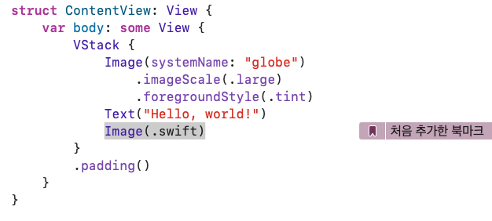

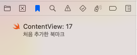

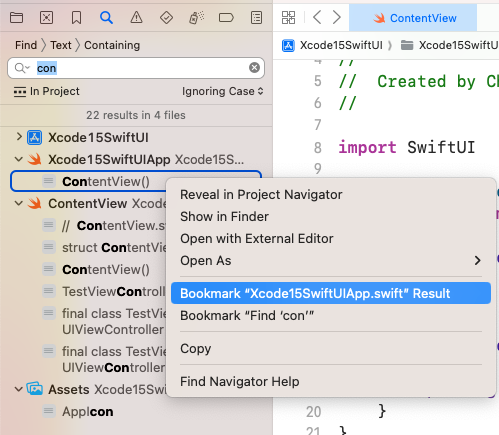

## Documentaion
- Editor > Assistant > Documentation Preview 를 누르면 해당 파일의 문서를 확인할 수 있다고 한다. 
- 이 문서는 마크다운 문법으로 쉽게 작성할 수 있다고 한다.
	- 자세한 내용은 [swift dooc 문서](https://developer.apple.com/documentation/docc) 를 참고하면 될 것 같다.

## Testing
- 테스트 코드를 실행하는 속도가 45% 정도 향상 되었다고 한다.
- 이런 화면이 생겼다.


## Log
- 콘솔창이 알록달록해졌다. (로그 타입에 맞게 컬러가 적용되어 가독성을 높인다.)
